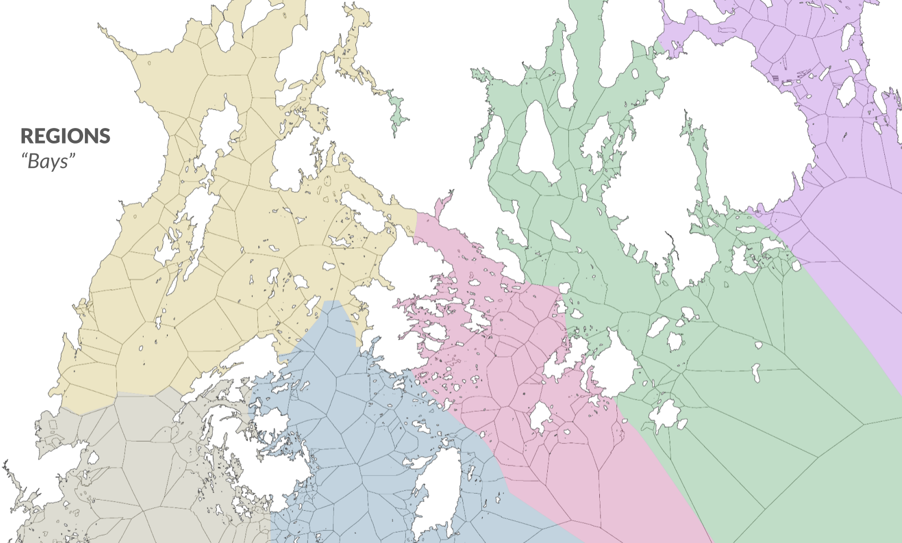

```{r libraries, results='hide', message = FALSE, echo = FALSE,  warning = FALSE}

#install.packages("tidyverse")
#install.packages("readxl")
#devtools::install_github("gadenbuie/xaringanExtra")
#install.packages("fontawesome")


library(dplyr)
library(leaflet)
library(readxl)
library(xaringanExtra)
library(fontawesome)
library(icons)
library(DT)
library(htmltools)
library(htmlwidgets)
library(kableExtra)
library(readr)
library(pdftools)
library(tidyverse)
library(tidytext)
library(dplyr)
library(textclean)
library(stopwords)

knitr::opts_chunk$set(message=FALSE, warning=FALSE, hiline=TRUE)

xaringanExtra::use_xaringan_extra(include = c("panelset", "tile_view", "share_again", "use_broadcast"))

xaringanExtra::style_share_again(share_buttons = c("twitter", "linkedin", "pocket"))


```


background-image: url(images/coastal_map.png)
background-position: top right
background-size: contain
class: middle, left

# `r rmarkdown::metadata$title`


## `r rmarkdown::metadata$author`

### `r rmarkdown::metadata$subtitle`, `r rmarkdown::metadata$date`


.footnote[]

---
class: middle, left
# About me

.pull-left[

.center[


### Dr. Laurie Baker

]]

.pull-right[

### `r icons::fontawesome("graduation-cap")` BSc Marine Biology, University of St. Andrews
### `r icons::fontawesome("graduation-cap")` Msc Marine Biology, Dalhousie University
### `r icons::fontawesome("graduation-cap")` PhD Ecology and Evolution, University of Glasgow
]

.center[
[`r icons::fontawesome("link")` lauriebaker.rbind.io](https://lauriebaker.rbind.io)
[`r icons::fontawesome("twitter")` @llbaker1707](https://twitter.com/llbaker1707)
[`r icons::icon_style(icons::fontawesome("github"), scale = 1)` @laurielbaker](https://github.com/laurielbaker)
]

---
class: middle, left
# About me

.pull-left[

.center[


### Dr. Laurie Baker

]]

.pull-right[

#### `r icons::fontawesome("syringe")`  Medical Research Council Fellow, University of Glasgow
#### `r icons::fontawesome("desktop")` Data Science Lecturer and Head of Faculty, Data Science Campus, Office for National Statistics
#### `r icons::fontawesome("desktop")` Visiting Assistant Professor, Digital and Computational Studies, Bates College
#### `r icons::fontawesome("desktop")` Assistant Professor, Computer Science and Data Science, College of the Atlantic
]

.center[
[`r icons::fontawesome("link")` lauriebaker.rbind.io](https://lauriebaker.rbind.io)
[`r icons::fontawesome("twitter")` @llbaker1707](https://twitter.com/llbaker1707)
[`r icons::icon_style(icons::fontawesome("github"), scale = 1)` @laurielbaker](https://github.com/laurielbaker)
]
???

---
class: middle, left
# Research Interests

.left-column[
.center[

]
]

.right-column[

.center[
## `r icons::fontawesome("satellite")` 
]
### Spatial and temporal patterns in human and biological systems

### - Disease spread
### - Animal movement
### - Fisheries management

]

---
class: middle, left
# Research Interests

.left-column[
.center[

]
]

.right-column[
.center[
## `r icons::fontawesome("satellite")` 
### Use of novel data sources to inform policy
]

### - Acoustic and GPS tracking
### - Oral Histories


]

???

My work occurs at the intersection of Ecology, Math and Statistics, and Computer Science.


---
# Mapping Ocean Stories

.pull-left[

.center[

]
]

.pull-right[
### `r icons::fontawesome("graduation-cap")` Collaboration between The Island Institute, Maine Sea Grant, The First Coast, and The College of the Atlantic.
### `r icons::fontawesome("headphones")` Series of oral history and audio storytelling projects, courses, and exhibits.

]

### `r icons::fontawesome("bullhorn")` **Goal:** To Amplify the Voices of Maine's Coastal Communities

???

---
class: 
# Mapping Ocean Stories

### March 2023 received a grant from the Maine Community Foundation to further develop two key outputs: Maine Sound + Story and the Maine Historic Fisheries Atlas.
### `r icons::fontawesome("globe")` Use text analysis and spatial coding to understand the past and present use of Frenchman and Penobscot Bays

---
class: center
# Oral History Archives: Maine Sound + Story

.center[
<iframe src="https://mainesoundandstory.com/" width="940" height="456" frameBorder="0"></iframe>
]

[Maine Sound and Story](https://mainesoundandstory.com)

???
Maine Sound & Story seeks to document and preserve the collective history, memory, and stories of Maine through sound, images, and oral history.


---
class: center
# Maine Historic Fisheries Atlas

.center[
<iframe src="https://mos-data-coagis.hub.arcgis.com/pages/data-entry" width="940" height="456" frameBorder="0"></iframe>
]

[Maine Sound and Story](https://mainesoundandstory.com)

???
Maine Sound & Story seeks to document and preserve the collective history, memory, and stories of Maine through sound, images, and oral history.


---
class: center

<figure>
    
    <figcaption>Figure 1. Diagram of the mapping ocean stories data analysis workflow.</figcaption>
</figure>

???

The database is designed to record spatial, categorical, observational, and temporal information about each activity. 
---
class: center
# Database Structure
.left-column[
<figure>
    
         
    <figcaption>Figure 2. MOS - Database Basic Structure.</figcaption>
</figure>
]

.right-column[

## - Who?
## - What?
## - Where?
## - When?

]
???
Spatial activities are categorized by coders by their domain, subdomain, and observation type to create a set of standardized observations that can be reliably compared later using queries, summaries, and other systematic methods (Figure 3). 

---
class: center
# Project Codebook

<figure>
    
    <figcaption>Figure 3. Subset of the codebook showing the domain, subdomain, observation type and observation levels for the fisheries domain.</figcaption>
</figure>

???
The spatial information for each activity is then classified by the geomethod and type of spatial information conveyed (Figure 4).

- **Domain** Activity Classification (Fisheries,
Aquaculture, Recreation)
- **Subdomain** Subcategorization and specificity for
observations (e.g. by species for fishing)
- **Who** 
- **When**
---
class: center
# Spatial Classification Scheme

<figure>
    
    <figcaption>Figure 4. Spatial classification scheme by geomethod.</figcaption>
</figure>

---
# Conducting a spatial interview

---
class: center
# Oral History Interview

.center[
<iframe src="https://mainesoundandstory.com/record/josh-kane/" width="940" height="456" frameBorder="0"></iframe>
]

[Josh Kane Interview](https://mainesoundandstory.com/record/josh-kane/)

---
class: center
# Oral History Transcript

.center[
<iframe src="https://mainesoundandstory.s3.us-east-2.amazonaws.com/wp-content/uploads/2023/09/24154031/Kane_Josh_06.22.2023.pdf" width="940" height="456" frameBorder="0"></iframe>
]

[Josh Kane Interview Transcript](https://mainesoundandstory.s3.us-east-2.amazonaws.com/wp-content/uploads/2023/09/24154031/Kane_Josh_06.22.2023.pdf)

---
# Using Text Analysis for Interview Processing

### - Read in the transcript and identify speakers
### - Identify relevant sections for spatial coding
### - Collect information related to key questions

---
# In Practice - packages
```{r message = FALSE, warning = FALSE}
library(pdftools) # read in pdf
library(tidyverse) # data wrangling and visualization
library(tidytext) # text analysis
library(stopwords) # stop words
```

---
# In Practice - reading in the transcript

```{r message = FALSE, warning = FALSE}
kane_full_text <- pdftools::pdf_text(pdf = "../data/Kane_Josh_06.22.2023.pdf")

# convert text to string
kane_full_text <- toString(kane_full_text)

# convert text to character lines
kane <- read_lines(kane_full_text)

kane <- tibble(kane)
kane <- kane %>%
  rename(text = kane) %>%
  filter(text != "") %>% 
  mutate(interview_section = if_else(str_detect(text, pattern = "0:00:00"), "main", NA)) %>%
  fill(interview_section, .direction = "down") %>%
  filter(interview_section == "main")
```

---
# In Practice - identifying speakers

```{r }
kane <- kane %>%
  mutate(initials = str_extract(text, pattern = "[A-Z]{1,3}\\:")) %>%
  mutate(initials = str_replace(initials, pattern = ":", replacement = "")) %>%
  fill(initials, .direction = "down") %>%
  filter(is.na(initials) == FALSE) %>%
  mutate(text = str_replace_all(text, "[A-Z]{1,3}:", "")) %>%
  mutate(group = cumsum(initials != lag(initials, default = "")))

kane <- kane %>%
  group_by(initials, group) %>%
  summarise(text = str_c(text, collapse = " ")) %>%
  mutate(text = str_squish(text)) %>%
  ungroup() %>% 
  arrange(group)
```

---
# Transcript Text

```{r echo = FALSE}
kane %>%
  DT::datatable()
```

---
# Searching for locations code

```{r eval = FALSE}

locations <- "bar harbor|Bar Harbor|Frenchman|frenchman|bay|Bay|porcupine|Porcupine|island|Island|Bar|bar"

kane %>%
  filter(initials == "JK") %>%
  filter(str_detect(text, pattern = locations)) %>%
  DT::datatable()
```

---
# Searching for locations


```{r echo = FALSE}

locations <- "bar harbor|Bar Harbor|Frenchman|frenchman|bay|Bay|porcupine|Porcupine|island|Island|Bar|bar"

kane %>%
  filter(initials == "JK") %>%
  filter(str_detect(text, pattern = locations)) %>%
  DT::datatable()
```

---
# Searching for species code

```{r eval = FALSE}

species <- "shrimp|Shrimp|Halibut|halibut|Lobster|lobster|Pogies|pogies|Menhayden|menhayden"

kane %>%
  filter(initials == "JK") %>%
  filter(str_detect(text, pattern = species)) %>%
  DT::datatable()
```

---
# Searching for species

```{r echo = FALSE}

species <- "shrimp|Shrimp|Halibut|halibut|Lobster|lobster|Pogies|pogies|Menhayden|menhayden"

kane %>%
  filter(initials == "JK") %>%
  filter(str_detect(text, pattern = species)) %>%
  DT::datatable()
```

---
# Prepositions

```{r, echo=FALSE, out.width=600, fig.align='center', fig.cap="Prepositions"}

knitr::include_graphics("images/prepositions.jpeg")

```
---
# Breaking down into words

```{r}
kane %>%
  unnest_tokens(word, text, token='words') 
```


---
# Parts of Speech

```{r}
kane %>%
  unnest_tokens(word, text, token='words') %>% 
  inner_join(parts_of_speech, relationship = "many-to-many")

```

---
# Prepositions and parts of speech

```{r}
kane %>%
  unnest_tokens(word, text, token='words') %>% 
  inner_join(parts_of_speech, relationship = "many-to-many") %>% 
  filter(pos == "Preposition") %>%
  count(word) %>%
  arrange(desc(n))

```
---
# Thank You!

.left-column[
```{r, echo=FALSE, out.width=400, fig.align='center', fig.cap="Coastal_Map"}


```


Slides created via the R package [**xaringan**](https://github.com/yihui/xaringan).

The chakra comes from [remark.js](https://remarkjs.com), [**knitr**](http://yihui.name/knitr), and [R Markdown](https://rmarkdown.rstudio.com).
]

.right-column[

**College of the Atlantic, Maine Sea Grant,  and Rhumbline Maps**:  
- Natalie Springuel (Maine Sea Grant)
- Todd Little-Siebold (College of the Atlantic) 
- Galen Koch (The First Coast/College of the Atlantic)
- Ben Meader (Haley Ward); Eliza Carter, Vincent Falardeau, and Emily Meader (Rhumbline Maps)

]

---
class: inverse, center, middle
# Additional slides

???
