```{r libraries, results='hide', message = FALSE, echo = FALSE,  warning = FALSE}

#install.packages("tidyverse")
#install.packages("readxl")
#devtools::install_github("gadenbuie/xaringanExtra")
#install.packages("fontawesome")
#remotes::install_github("mitchelloharawild/icons")

library(dplyr)
library(leaflet)
library(readxl)
library(xaringanExtra)
library(fontawesome)
library(icons)
library(DT)
library(htmltools)
library(htmlwidgets)
library(kableExtra)
library(readr)
library(pdftools)
library(tidyverse)
library(tidytext)
library(dplyr)
library(textclean)
library(stopwords)

knitr::opts_chunk$set(message=FALSE, warning=FALSE, hiline=TRUE)

xaringanExtra::use_xaringan_extra(include = c("panelset", "tile_view", "share_again", "use_broadcast"))

xaringanExtra::style_share_again(share_buttons = c("twitter", "linkedin", "pocket"))

```


background-image: url(images/coastal_map.png)
background-position: top right
background-size: contain
class: middle, left

# `r rmarkdown::metadata$title`


## `r rmarkdown::metadata$author`

### `r rmarkdown::metadata$subtitle`, `r rmarkdown::metadata$date`


.footnote[]

---
class: middle, left
# About me

.pull-left[

.center[


### Dr. Laurie Baker

]]

.pull-right[

### `r icons::fontawesome("graduation-cap")` BSc Marine Biology, University of St. Andrews
### `r icons::fontawesome("graduation-cap")` Msc Marine Biology, Dalhousie University
### `r icons::fontawesome("graduation-cap")` PhD Ecology and Evolution, University of Glasgow
]

.center[
[`r icons::fontawesome("link")` lauriebaker.rbind.io](https://lauriebaker.rbind.io)
[`r icons::fontawesome("twitter")` @llbaker1707](https://twitter.com/llbaker1707)
[`r icons::icon_style(icons::fontawesome("github"), scale = 1)` @laurielbaker](https://github.com/laurielbaker)
]

---
class: middle, left
# Talk Outline

### - Career Path from Marine Biology to Data Science
### - Connecting Students with Communities in Community-Engaged Data Science
### - Current Research Project: Mapping Ocean Stories


```{r packages for fish analysis, echo=FALSE, message=FALSE, warning=FALSE}
library(leaflet)
library(tidyverse)
library(lubridate)
library(sf)
```

```{r data for fish analysis, echo=FALSE, message=FALSE, warning=FALSE}

palangre87_97 <- read_csv("slides/data-chile/palangre_87_97.csv")

```

---
class: middle, left
# Research Interests

.left-column[
.center[

]
]

.right-column[

### Spatial and temporal patterns in human and biological systems

### - Disease spread
### - Animal movement
### - Fisheries management

]

---
# Target species in the Chilean longline fishery

.pull-left[

.center[
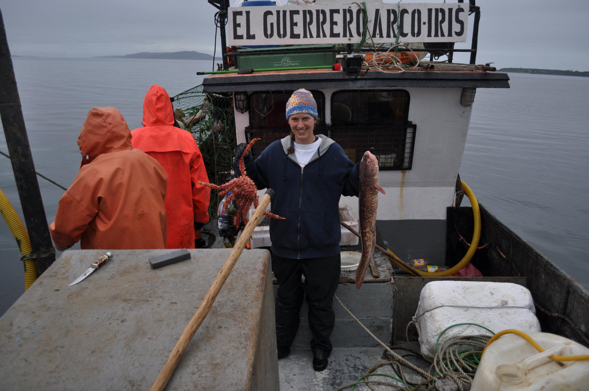
]

]

.pull-right[
## Topics
### `r icons::fontawesome("fish")`  **Fisheries Management**
### `r icons::fontawesome("globe")` **Spatial Statistics**

]

### `r icons::fontawesome("lightbulb")` What factors influence a fisher's target species (market value, weather, location, time of year) under different management practices?

???
I used catch composition and machine learning to infer a fisher's target species and used generalized additive models to explore the factors influencing target species.

---
# Grey seals as bioprobes
.pull-left[

.center[

]

]

.pull-right[
## Topics

### `r icons::fontawesome("fish")`  **Ecology**
### `r icons::fontawesome("globe")` **Animal Movement**
]

### `r icons::fontawesome("lightbulb")` What is the detection efficiency of acoustic tags in the field? What potential is there to use grey seals to sample the marine environment?

???

---

# Grey seals as bioprobes
.pull-left[

.center[
<iframe src="https://www.google.com/maps/embed?pb=!1m18!1m12!1m3!1d367544.6964222735!2d-60.215552395501966!3d43.97088868870316!2m3!1f0!2f0!3f0!3m2!1i1024!2i768!4f13.1!3m3!1m2!1s0x4b4689632ca41c27%3A0xfcd36f09136414e!2sSable%20Island!5e0!3m2!1sen!2sus!4v1630508253565!5m2!1sen!2sus" width="560" height="420" style="border:0;" allowfullscreen="" loading="lazy"></iframe>

]

]

.pull-right[
## Topics

### `r icons::fontawesome("fish")`  **Ecology**
### `r icons::fontawesome("globe")` **Animal Movement**
]

### `r icons::fontawesome("lightbulb")` What is the detection efficiency of acoustic tags in the field? What potential is there to use grey seals to sample the marine environment?

???

---
# Spread and control of fox rabies in Europe

.pull-left[

.center[

]
]

.pull-right[
## Topics

### `r icons::fontawesome("fish")`  **Ecology**
### `r icons::fontawesome("syringe")`  **Public Health**
### `r icons::fontawesome("globe")` **Spatial Statistics**

]

### `r icons::fontawesome("lightbulb")` What can we learn about vaccination planning from the successful elimination of rabies in Western Europe?

---
# Alan Turing Institute Data Study Groups

.pull-left[

.center[
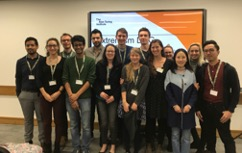
]
]

.pull-right[
## Topics

### `r icons::fontawesome("language")`  **Natural Language Processing**
### `r icons::fontawesome("desktop")`  **Machine Learning**
### `r icons::fontawesome("image")` **Image Processing**

]

### `r icons::fontawesome("lightbulb")` Week-long Hackathon working with an industry or government partner (e.g. Cabinet Office, British Antarctic Survey, Samsung, and Cochrane Systematic Reviews). 

---
class: middle, left
# Data Science Campus, Office for National Statistics

.left-column[
.center[

]
]

.right-column[


### - Data Science projects related to UN Sustainable Development Goals

### - Teaching

### - Mentoring

]

---
# Mapping Ocean Stories

.pull-left[

.center[
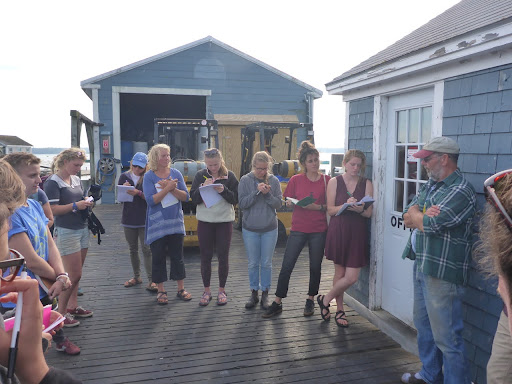
]
]

.pull-right[

#### `r icons::fontawesome("graduation-cap")` Collaboration with the Island Institute, Maine Sea Grant, The First Coast, College of the Atlantic, and Bates College.
#### `r icons::fontawesome("headphones")` Series of oral history and audio storytelling projects, courses, and exhibits.

```{r, echo=FALSE, out.width=450, fig.align='center', fig.cap="Stonington Soundwalk map by Kristina Buckley © 2023"}

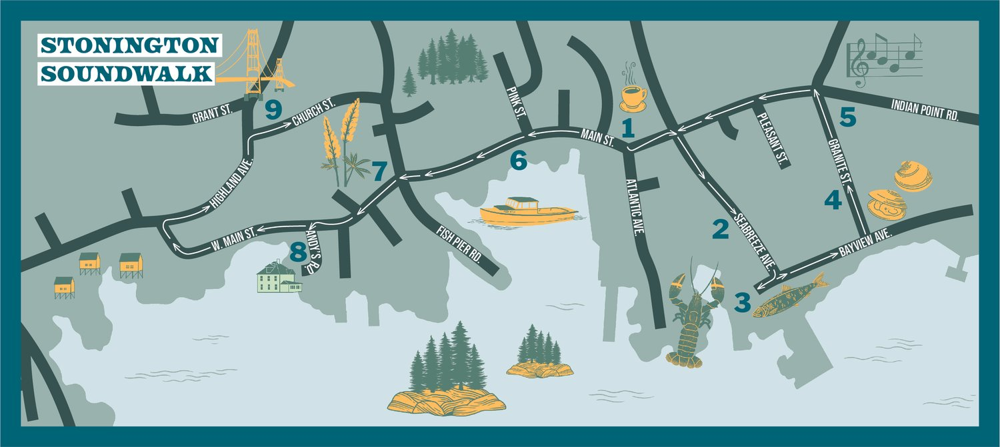

```


]

???

---
class:
# Mapping Ocean Stories Goals

```{r mos goals, out.width = 880, echo = FALSE, message = FALSE}
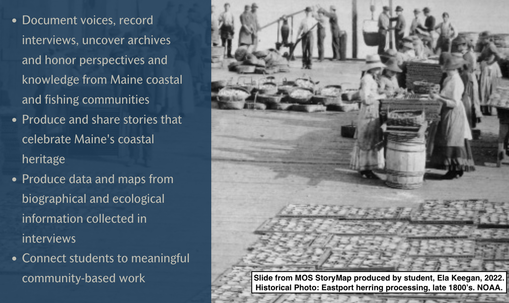

```


---
class:
# Mapping Ocean Stories

<iframe width="960" height="505" src="https://www.youtube.com/embed/__oa_9Gugmg?si=pthIL7fCYvOLtdeW" title="YouTube video player" frameborder="0" allow="accelerometer; autoplay; clipboard-write; encrypted-media; gyroscope; picture-in-picture; web-share" referrerpolicy="strict-origin-when-cross-origin" allowfullscreen></iframe>

---
class: 
# Mapping Ocean Stories Timeline

### Began with 2017 class *Mapping Ocean Stories* and 2020 class created the Mt. Desert Island Historical Fisheries Atlas.
### `r icons::fontawesome("headphones")` March 2023 received a grant to further develop two key outputs: Maine Sound + Story and the Maine Historical Fisheries Atlas (MHFA).

### 1. Develop a coding scheme for spatial data mentioned in interviews
### 2. Build a hub site to host the Maine Historical Fisheries Atlas (*Work with Ben Meader Middlebury '10)
### 3. Use text analysis to support the spatial coding process

---
class: center

<figure>
    
    <figcaption>Figure 1. Diagram of the Mapping Ocean Stories Data Analysis Workflow.</figcaption>
</figure>

???

The database is designed to record spatial, categorical, observational, and temporal information about each activity.

---
# Biographical Mapping Interviews
.pull-left[
```{r echo = FALSE, out.width = 550}
knitr::include_graphics("images/mos-bio-map.jpg")
```
]

.pull-right[Natalie Springuel (Maine Sea Grant) and
MOS Class with David Thomas in Islesford, Little Cranberry]

---
# Digitizing the Biographical Mapping Interview

<center>
<video width="800" height="500" controls>
  <source src="media/Spatial_Data_Editor_Demo.mp4" type="video/mp4">
  <source src="media/Spatial_Data_Editor_Demo.ogg" type="video/ogg">
Your browser does not support the video tag.
</video>
</center>

---
class: center
# Digitized Locations

```{r, echo=FALSE, out.width=800, fig.align='center', fig.alt="Scallop Dragging"} 

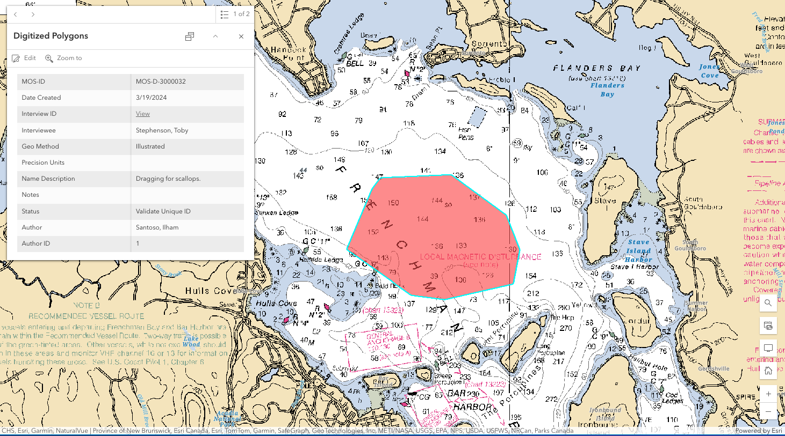

```

---
class: center
# Spatial Data from Oral History Archives

.pull-left[

```{r echo = FALSE}
knitr::include_graphics("images/mos-archives.png")
```

[Maine Sound + Story](https://mainesoundandstory.com/)

]

.pull-right[

```{r echo = FALSE, fig.cap = "Photo of Herbert Carter Jr."}
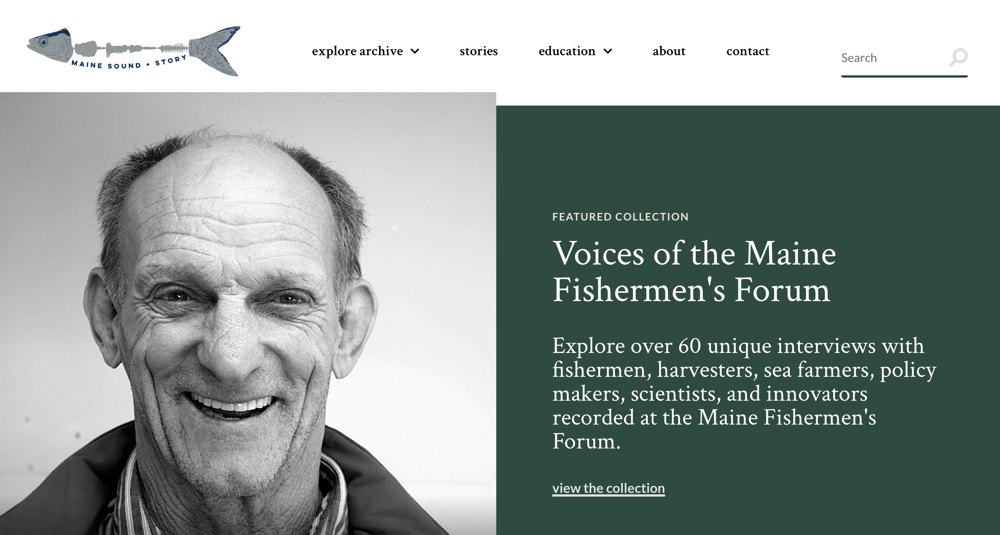
```

### ~500 oral histories from historical societies, The First Coast, and student-led interviews.

### 1970s to present


]


---
class: center
# Spatial Data from Oral History Archives

.center[
<iframe src="https://mainesoundandstory.com/record/josh-kane/" width="940" height="456" frameBorder="0"></iframe>
]

[Josh Kane Interview](https://mainesoundandstory.com/record/josh-kane/)

---
class: center
# Oral History Transcript

.center[
<iframe src="https://mainesoundandstory.s3.us-east-2.amazonaws.com/wp-content/uploads/2023/09/24154031/Kane_Josh_06.22.2023.pdf" width="940" height="456" frameBorder="0"></iframe>
]

[Josh Kane Interview Transcript](https://mainesoundandstory.s3.us-east-2.amazonaws.com/wp-content/uploads/2023/09/24154031/Kane_Josh_06.22.2023.pdf)

---
# Spatial Data: Audio transcripts

 <font size="6"> "But we would go up and <strong>fish the channels, which is on the other side of Long [Porcupine] and you could always fish all the way up to Bald Rock and then back to the [southern?]</strong>. You could tow up and down through there and catch a couple of hundred an hour of shrimp on a good day, a couple hundred pounds an hour. So some of the best fishing I’d ever seen was just on that side of that island, just like a whole bunch of boats going back and forth. And shrimp were–it was a lot of shrimp."* </font> 

.footnote[Kane, Josh, Frenchman Bay Oral History Project, June 22nd, 2023, by Camden Hunt, 22 pages, Maine Sound and Story. Online: https://mainesoundandstory.s3.us-east-2.amazonaws.com/wp-content/uploads/2023/09/24154031/Kane_Josh_06.22.2023.pdf (Last Accessed: 03/18/2024).]

---
# Using Text Analysis for Interview Processing

### - Read in the transcript and identify speakers
### - Identify relevant sections for spatial coding
### - Identify information related to key questions

---
class: center
# Spatial Coding Tool

.center[
<iframe src="https://laurie-the-student-baker.shinyapps.io/CodingSpatialMentions/" width="940" height="456" frameBorder="0"></iframe>
]

[Josh Kane Interview Transcript](https://mainesoundandstory.s3.us-east-2.amazonaws.com/wp-content/uploads/2023/09/24154031/Kane_Josh_06.22.2023.pdf)

---
# Expanding the Spatial Glossary

<center>
<video width="800" height="500" controls>
  <source src="media/Spatial_Glossary_Add_Alt_Names.mp4" type="video/mp4">
  <source src="media/Spatial_Glossary_Add_Alt_Names.ogg" type="video/ogg">
Your browser does not support the video tag.
</video>
</center>


Sources of Spatial Data: NOAA Charts, GNIS, Public

[MOS Spatial Glossary](https://mos-data-coagis.hub.arcgis.com/apps/a6c101ea5fc643bbb3c7067a0b8d86a4)

---
class: left
# Where we are now

.pull-left[
```{r, echo=FALSE, out.width=900, fig.align='center', fig.alt="Map with Polygons"}

knitr::include_graphics("images/where_now_101.png")

```
]

.pull-right[

.center[
# **101**
## MS+S Coded Interviews
# **18**
## Biographical Mapping Interviews
]
]
---
class: left
# Future Work

### - Continue to develop data collection and text analysis processes
### - Understand spatial semantics in the marine environment
### - Share the Spatial Glossary and Data Query with others
### - Further develop the uncertainty quantification and spatial classification schemes
### - Explore the potential for Large Language Models


---
# Thank You!

.left-column[

**College of the Atlantic, Maine Sea Grant, Island Institute, Haley Ward, and Rhumbline Maps**:  
- Natalie Springuel (Maine Sea Grant)
- Todd Little-Siebold, Delphine DeMaisy, Will Draxler, Ilham Santoso, Linnea Goh, Asy Xaytouthor (College of the Atlantic) 
- Galen Koch (The First Coast/College of the Atlantic/Island Institute)
- Ben Meader '10 (Haley Ward)
- Nick Battista (Island Institute)

**Funding Support:**
- The Fund for Maine Islands
- The Maine Community Foundation
]

.right-column[
**MOS Outputs**
- Island Institute’s podcast: [https://www.islandinstitute.org/stories/podcast/](https://www.islandinstitute.org/stories/podcast/)

- Coastal Conversations radio show: [https://seagrant.umaine.edu/coastal-conversations-radio-program/](https://seagrant.umaine.edu/coastal-conversations-radio-program/)
- Maine Sound + Story Archive: [www.mainesoundandstory.com](www.mainesoundandstory.com)
- The First Coast’s exhibits:  [www.thefirstcoast.org](www.thefirstcoast.org)
- Historic Fisheries Atlas: [https://mos-data-coagis.hub.arcgis.com/](https://mos-data-coagis.hub.arcgis.com/).

]


---
class: inverse, center, middle
# Additional slides

???


---
# Target species in the Chilean longline fishery

.pull-left[

.center[

]

]

.pull-right[
## Topics
### `r icons::fontawesome("fish")`  **Fisheries Management**
### `r icons::fontawesome("globe")` **Spatial Statistics**

]

### `r icons::fontawesome("lightbulb")` What factors influence a fisher's target species (market value, weather, location, time of year) under different management practices?

???
I used catch composition and machine learning to infer a fisher's target species and used generalized additive models to explore the factors influencing target species.

---
class: middle, left
# Who is fishing?

```{r echo=FALSE, out.width="65%", fig.align="center", fig.alt = "Plot showing the vessel length and width as boats on a scatter plot where the size of the boat is proportional to the carrying capacity of the vessel"}
knitr::include_graphics("slides/figs/fishing_who.png")
```

---
class: middle, left
# How are vessels fishing?

```{r echo=FALSE, out.width="65%", fig.align="center", fig.alt = "Plot showing the distribution of trip length by vessel"}
knitr::include_graphics("slides/figs/fishing_when.png")
```


---
class: middle, left
# What are vessels targeting?

```{r echo=FALSE, out.width="65%", fig.align="center", fig.alt = "Plot showing the distribution of species in the catch by weight by vessel"}
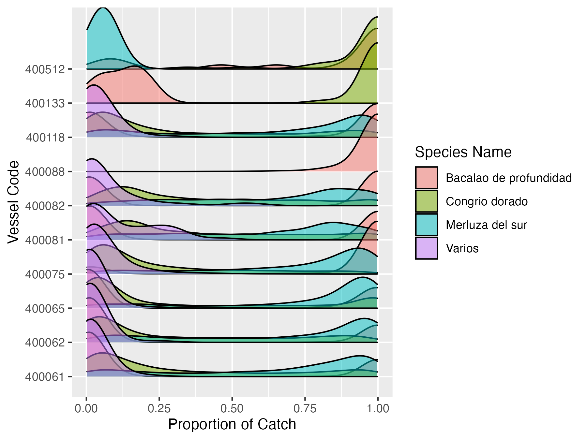
```

---
class: middle, left
# Where are they fishing?


```{r location data prep 87 to 97, echo = FALSE}

palangre87_97 <- palangre87_97 %>%
  mutate(startlatdd = -latcalini/10000,
         startlondd = -loncalini/10000,
         group = as.factor(paste(CBU_ORAC, crucero, lance)),
         P_X6 = X6/Total.de.peso)

```


```{r chile-fishing-map, echo = FALSE, out.width="75%", fig.align="center", fig.alt = "Map of fishing locations in Chile"}
pal <- colorNumeric(
  palette = "Oranges",
  domain = palangre87_97$P_X6)


palangre87_97$labels <- sprintf("<strong>Vessel Code: %s</strong><br/>%g proportion of catch", 
                  palangre87_97$CBU_ORAC, palangre87_97$P_X6) %>% lapply(htmltools::HTML)

(start_position_map <- leaflet(data = palangre87_97) %>%
   setView(lng = -68.527060, lat = -46.162921, zoom = 4) %>%
  addProviderTiles(providers$Esri.WorldImagery) %>%
  addCircleMarkers(data = palangre87_97[palangre87_97$CBU_ORAC == 400062,], 
                   lng = ~startlondd, 
                   lat = ~startlatdd, 
                   clusterOptions = NULL, 
                   color = ~pal(P_X6), 
                   label = palangre87_97[palangre87_97$CBU_ORAC == 400062,]$labels,
                   radius = 2,
                   group = "Vessel 400062") %>%
    addCircleMarkers(data = palangre87_97[palangre87_97$CBU_ORAC == 400065,], 
                   lng = ~startlondd, 
                   lat = ~startlatdd, 
                   clusterOptions = NULL, 
                   color = ~pal(P_X6), 
                   label = palangre87_97[palangre87_97$CBU_ORAC == 400065,]$labels,
                   radius = 2,
                   group = "Vessel 400065") %>%
    addCircleMarkers(data = palangre87_97[palangre87_97$CBU_ORAC == 400075,],
                   lng = ~startlondd,
                   lat = ~startlatdd,
                   clusterOptions = NULL,
                   color = ~pal(P_X6),
                   label = palangre87_97[palangre87_97$CBU_ORAC == 400075,]$labels,
                   radius = 2,
                   group = "Vessel 400075") %>%
    addCircleMarkers(data = palangre87_97[palangre87_97$CBU_ORAC == 400082,],
                   lng = ~startlondd,
                   lat = ~startlatdd,
                   clusterOptions = NULL,
                   color = ~pal(P_X6),
                   label = palangre87_97[palangre87_97$CBU_ORAC == 400082,]$labels,
                   radius = 2,
                   group = "Vessel 400082") %>%
    addCircleMarkers(data = palangre87_97[palangre87_97$CBU_ORAC == 400088,],
                   lng = ~startlondd,
                   lat = ~startlatdd,
                   clusterOptions = NULL,
                   color = ~pal(P_X6),
                   label = palangre87_97[palangre87_97$CBU_ORAC == 400088,]$labels,
                   radius = 2,
                   group = "Vessel 400088") %>%
    addCircleMarkers(data = palangre87_97[palangre87_97$CBU_ORAC == 400118,],
                   lng = ~startlondd,
                   lat = ~startlatdd,
                   clusterOptions = NULL,
                   color = ~pal(P_X6),
                   label = palangre87_97[palangre87_97$CBU_ORAC == 400118,]$labels,
                   radius = 2,
                   group = "Vessel 400118") %>%
    addCircleMarkers(data = palangre87_97[palangre87_97$CBU_ORAC == 400061,],
                   lng = ~startlondd,
                   lat = ~startlatdd,
                   clusterOptions = NULL,
                   color = ~pal(P_X6),
                   label = palangre87_97[palangre87_97$CBU_ORAC == 400061,]$labels,
                   radius = 2,
                   group = "Vessel 400061") %>%
    addCircleMarkers(data = palangre87_97[palangre87_97$CBU_ORAC == 400081,],
                   lng = ~startlondd,
                   lat = ~startlatdd,
                   clusterOptions = NULL,
                   color = ~pal(P_X6),
                   label = palangre87_97[palangre87_97$CBU_ORAC == 400081,]$labels,
                   radius = 2,
                   group = "Vessel 400081") %>%
    addCircleMarkers(data = palangre87_97[palangre87_97$CBU_ORAC == 400133,],
                   lng = ~startlondd,
                   lat = ~startlatdd,
                   clusterOptions = NULL,
                   color = ~pal(P_X6),
                   label = palangre87_97[palangre87_97$CBU_ORAC == 400133,]$labels,
                   radius = 2,
                   group = "Vessel 400133") %>%
    addCircleMarkers(data = palangre87_97[palangre87_97$CBU_ORAC == 400512,],
                   lng = ~startlondd,
                   lat = ~startlatdd,
                   clusterOptions = NULL,
                   color = ~pal(P_X6),
                   label = palangre87_97[palangre87_97$CBU_ORAC == 400512,]$labels,
                   radius = 2,
                   group = "Vessel 400512") %>%
    addLegend(position = "bottomright",
              pal = pal,
              values = ~P_X6,
              title = "Proportion of catch that is pink cusk-eel",
              opacity = 1)) %>%
    addLayersControl(
    overlayGroups = c("Vessel 400065", "Vessel 400062", "Vessel 400075",
                      "Vessel 400082", "Vessel 400088", "Vessel 400118",
                      "Vessel 400061", "Vessel 400081", "Vessel 400133",
                      "Vessel 400512"),
    options = layersControlOptions(collapsed = FALSE)
    )
```

---
class: 
# Inspiration


```{r, echo=FALSE, out.width=1000, fig.align='center', fig.alt="Map of Cod Spawning Grounds on the Coast of Maine"}

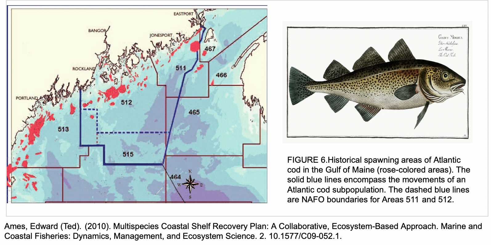

```

???
In Maine we have a rich history of collecting and sharing local ecological knowledge. Ted Ames collected and analyzed stories from 61- to 94-year-old Maine fishermen to show where cod had historically spawned and been caught along the coast of Maine and used this in addition to catch records to study movements of Atlantic cod. 


---
class: center
# Spatial Classification Scheme

<figure>
    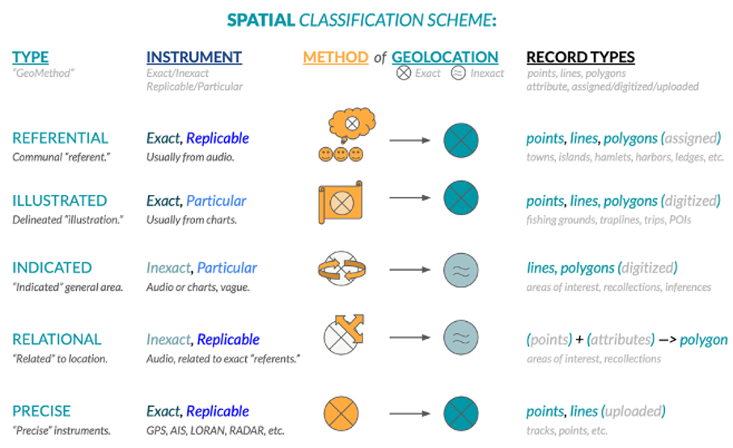
    <figcaption>Figure 4. Spatial classification scheme by geomethod.</figcaption>
</figure>

---
# Spatial Data: Biographical Mapping Interviews

```{r, echo=FALSE, out.width=500, fig.align='center', fig.cap="Spatial Interview: Frenchman Bay Coding Example 1"}

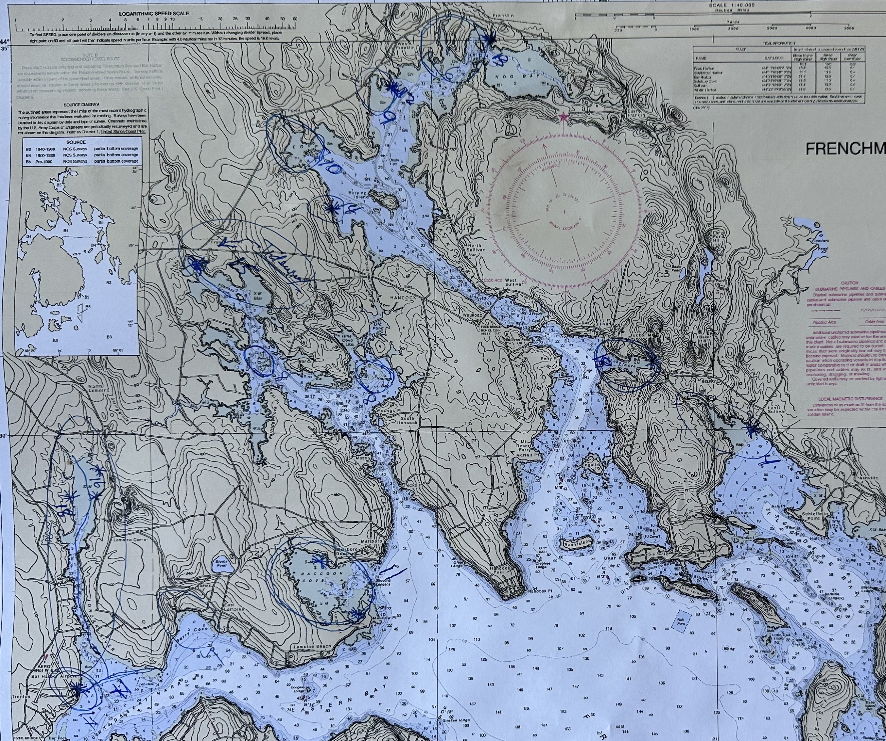

```

---
# Spatial Data: Map Overlay

```{r, echo=FALSE, out.width=800, fig.align='center', fig.cap="Spatial Interview: Frenchman Bay Coding Example"}

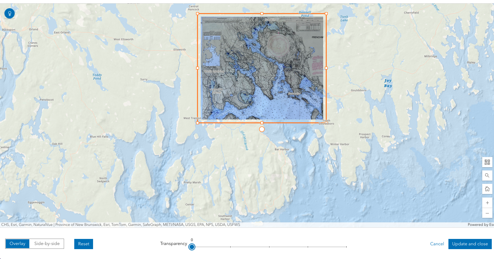

```

---
# Spatial Data: Digitization

```{r, echo=FALSE, out.width=800, fig.align='center', fig.cap="Spatial Interview: Frenchman Bay Coding Example"}

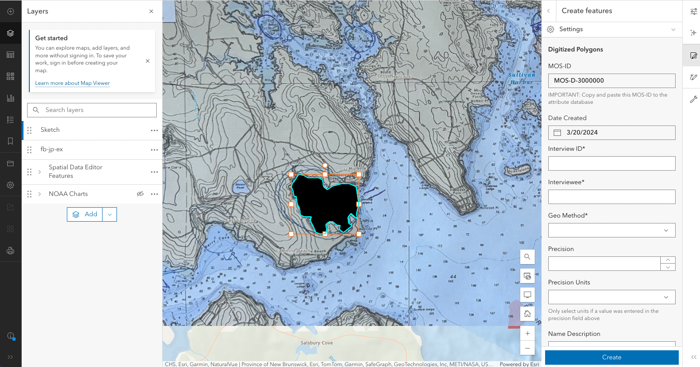

```
---
# Shrimp Tow: Referential

```{r, echo=FALSE, out.width=600, fig.align='center', fig.cap="Shrimp Tow"}

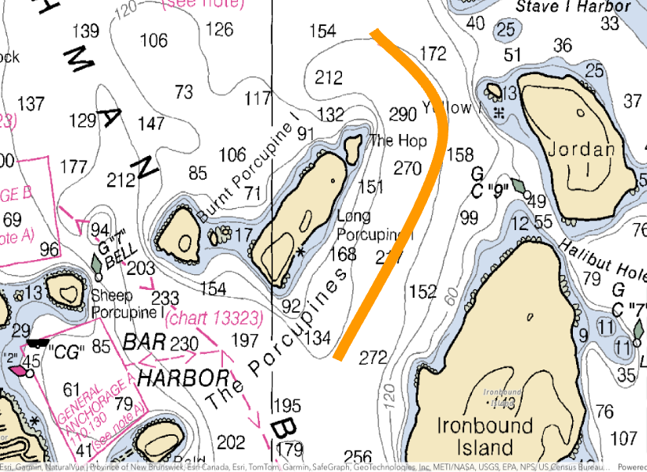

```

---
class: center
# Database Structure
.left-column[
<figure>
    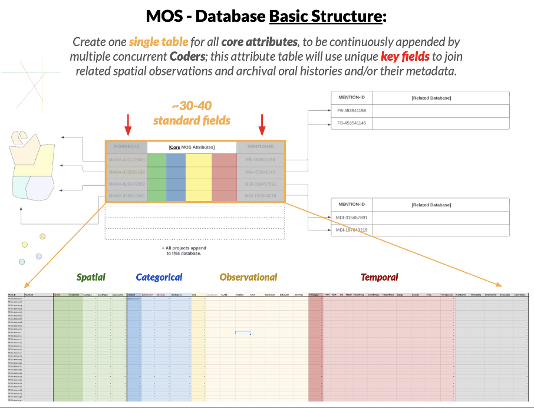
         
    <figcaption>Figure 2. MOS - Database Basic Structure.</figcaption>
</figure>
]

.right-column[

## - Who?
## - What?
## - Where?
## - When?

]
???
Spatial activities are categorized by coders by their domain, subdomain, and observation type to create a set of standardized observations that can be reliably compared later using queries, summaries, and other systematic methods (Figure 3). 

---
class: center
# Project Codebook

<figure>
    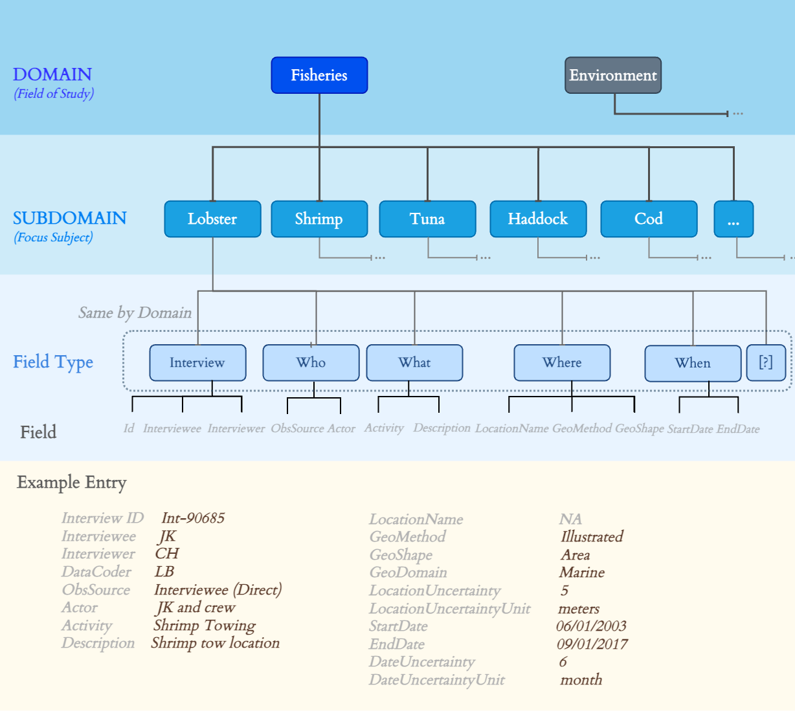
    <figcaption>Figure 3. Subset of the codebook showing the domain, subdomain, and data fields.</figcaption>
</figure>

???
The spatial information for each activity is then classified by the geomethod and type of spatial information conveyed (Figure 4).

- **Domain** Activity Classification (Fisheries,
Aquaculture, Recreation)
- **Subdomain** Subcategorization and specificity for
observations (e.g. by species for fishing)

---
# Future Work: Marine Prepositions

```{r, echo=FALSE, out.width=600, fig.align='center', fig.cap="Prepositions"}

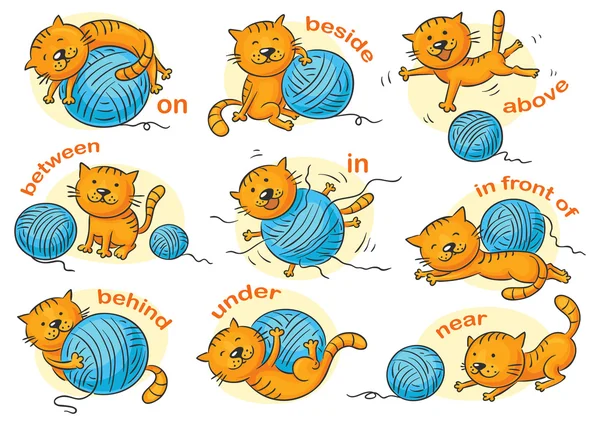
```

- Understanding prepositions in a marine context.
